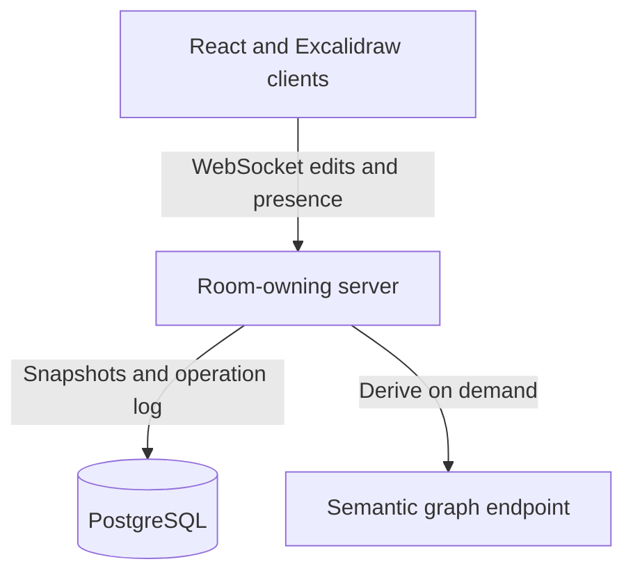

# Architecture

This is the current design direction. Details may change as the team validates the editor, sync protocol, and deployment plan.

## Data flow

The frontend uses React, strict TypeScript, Tailwind, a design system built with the designers, and `@excalidraw/excalidraw`. Semantic meaning lives in each element's `customData`, for example `{ kind: "database", props: { engine, replicas } }`. The Excalidraw document is the source of truth. Nodes and edges are derived from its elements and bindings when validation or feedback needs a graph.

## Collaboration and persistence

The planned Go WebSocket service is server-authoritative: it orders document operations, applies last-write-wins conflict resolution, and broadcasts changes. Presence and cursors are ephemeral. One process initially holds a map of rooms in memory, with a mutex for each room. HTTP/API paths remain stateless, and room memory is coordination state rather than durable storage. PostgreSQL stores periodic snapshots and an operation log between them so boards can be restored after a restart.

Local recovery after a disconnect, joining an active board, and reconciling local edits with remote updates are part of the editor design. Sharing must support view and edit access. Accounts are deferred for the initial experience.

## Decisions still open

- **Deployment:** The team intends to deploy the service itself; cloud provider and database hosting are undecided.
- **Scaling:** Horizontal scaling is deferred. A `RoomOwner` interface can preserve a path to Redis-backed ownership as a separate learning task without blocking the first demo. Redis may also serve as a cache, but PostgreSQL remains the durable store.
- **Canvas customization:** Start with embedded Excalidraw. Consider a fork only if the component experience cannot be built through its supported extension points.

See the [roadmap](roadmap.md) for possible product directions and [team workflow](workflow.md) for subsystem ownership.
